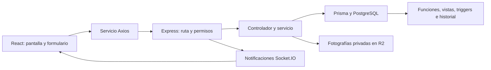
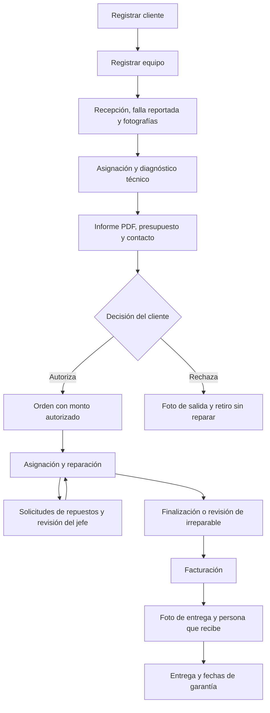

# Sistema de Gestión de Reparaciones

Sistema para recibir equipos electrónicos, coordinar diagnósticos y reparaciones, gestionar inventario y compras, facturar servicios y registrar entregas y garantías.

## Cómo usar esta documentación

La documentación se mantiene junto al código en las siguientes guías:

| Guía | Contenido |
| --- | --- |
| Este README | Mapa general, instalación, responsabilidades, flujo del negocio y catálogo de funciones. |
| [Frontend](frontend/README.md) | Carpetas de la interfaz, pantallas, componentes, hooks, servicios y navegación. |
| [Backend](backend/Readme.md) | API, permisos, Prisma, SQL, estados, fotografías R2, respaldos y pruebas. |
| [Parámetros genéricos de SGR](docs/parametros-genericos-sgr.md) | Inventario de todo lo configurable: negocio, reglas, usuarios, correos, infraestructura y elementos que requieren código. |

Empieza por el mapa general y abre la guía del módulo que vayas a modificar. Las tablas enlazan los archivos de entrada; el código define los detalles de cada operación.

### Índice

- [Mapa del proyecto](#mapa-del-proyecto)
- [Arquitectura y flujo de datos](#arquitectura-y-flujo-de-datos)
- [Instalación y operación local](#instalación-y-operación-local)
- [Configuración y despliegue](#configuración-y-despliegue)
- [Roles y funciones](#roles-y-funciones)
- [Flujo de atención](#flujo-de-atención)
- [Catálogo de casos de uso](#catálogo-de-casos-de-uso)
- [Dónde modificar cada función](#dónde-modificar-cada-función)
- [Datos y respaldos](#datos-y-respaldos)
- [Qué incluye un clon](#qué-incluye-un-clon)
- [Mantenimiento de código y documentación](#mantenimiento-de-código-y-documentación)

## Mapa del proyecto

```text
sistema-gestion-reparaciones/
  readme.md               Guía general del sistema.
  frontend/
    README.md             Guía de la interfaz y sus módulos.
    src/                  React, pantallas, componentes y comunicación con la API.
    tests/                Pruebas de fotos, recepción y teclado de Secretaría.
    dist/                 Resultado generado al compilar.
  backend/
    Readme.md             Guía de API, base de datos y operación.
    src/                  Express, controladores, servicios y validaciones.
    prisma/               Modelo de datos y semilla inicial.
    scripts/              Inicialización, funciones, vistas y triggers SQL.
    tests/                Pruebas de Secretaría, unitarias, API y SQL.
    tmp/                  Archivos temporales locales, excluidos de Git.
  postgres_data/          Datos de la instancia PostgreSQL de Docker.
  node_modules/           Dependencias de los comandos del proyecto.
  .vscode/                Configuración local del editor.
  .git/                   Historial y metadatos del repositorio.
  .gitignore              Exclusiones de datos, dependencias y secretos.
  .gitattributes          Configuración de archivos para Git.
  jsconfig.json           Configuración del editor para JavaScript.
  package.json            Comandos generales del proyecto.
  package-lock.json       Versiones resueltas de dependencias generales.
  docker-compose.yml      Servicios, variables, puertos y volúmenes locales.
```

`node_modules/` también existe dentro de frontend y backend. `dist/` se genera al compilar. Las fotos locales, cuando R2 está desactivado, se guardan en `backend/uploads/servicios` o en el directorio configurado mediante `SERVICE_UPLOAD_DIR`.

Los README son el mapa general; `docs/` contiene guías detalladas de administración, despliegue y parámetros modificables.

## Qué incluye un clon

Un clon contiene únicamente los archivos guardados en commits y publicados en el remoto. Para compartir cambios de código, esquema Prisma y funciones SQL se necesita `git add`, `git commit` y `git push` desde la carpeta de este repositorio. `git status` muestra los archivos modificados o nuevos que todavía no entran en un commit.

La base PostgreSQL activa está en `postgres_data/`, que Git excluye deliberadamente. También se excluyen `backend/.env`, fotos locales, dependencias y archivos generados. Un commit no copia los registros de clientes, equipos u órdenes: tras clonar, crea una base nueva con la instalación inicial o restaura un respaldo de PostgreSQL. Conserva por separado las fotos locales o los objetos R2 que correspondan al respaldo.

El nombre interno de la base local y algunos nombres de contenedores siguen usando el identificador histórico CTE para mantener las instalaciones existentes conectadas a sus datos. La marca visible del producto es **SGR — Sistema de Gestión de Reparaciones**. Cambiar esos identificadores internos requiere migrar o reconfigurar la base y las rutas de respaldo con una copia verificada.

## Arquitectura y flujo de datos

| Capa | Tecnología y responsabilidad | Entrada |
| --- | --- | --- |
| Interfaz | React, Vite, React Router, TanStack Query/Table, Axios y Tailwind. | [frontend/src/main.jsx](frontend/src/main.jsx), [App.jsx](frontend/src/App.jsx). |
| API | Express: autenticación, permisos, validación y operaciones del sistema. | [backend/src/server.js](backend/src/server.js), [app.js](backend/src/app/app.js). |
| Persistencia | PostgreSQL; Prisma para consultas y transacciones, SQL para reglas y reportes. | [schema.prisma](backend/prisma/schema.prisma), [load_functions.sql](backend/scripts/load_functions.sql). |
| Fotografías | Objetos privados en R2 y referencias en `ArchivosServicio`; lectura autenticada por la API. | [fotoStorage.js](backend/src/services/archivos/fotoStorage.js). |
| Avisos | Socket.IO con autenticación y salas por usuario o rol. | [notifications.js](backend/src/services/notifications.js). |
| Respaldos | Copias de la base de datos y exportaciones de inventario. | [backupService.js](backend/src/services/backupService.js). |



Una modificación que afecta los datos puede recorrer varias capas. Por ejemplo, recepción de equipos conecta la pantalla de diagnóstico, el servicio HTTP, las validaciones del backend, el esquema y las reglas SQL. Las fotografías se suben mediante solicitudes separadas después de guardar el servicio.

## Instalación y operación local

### Requisitos

- Docker Desktop con Docker Compose para ejecutar el entorno completo.
- Node.js y npm compatibles con las dependencias instaladas si se ejecuta o compila fuera de Docker. Los Dockerfile actuales utilizan Node 20.
- `psql` cuando se cargan archivos SQL desde el host; los contenedores del proyecto incluyen herramientas PostgreSQL.

Los comandos generales se ejecutan desde `sistema-gestion-reparaciones/`.

### Preparación

1. Crea `backend/.env` a partir de [backend/.env.example](backend/.env.example) y configura las variables necesarias.
2. Para ejecutar Vite desde el host, usa [frontend/.env.example](frontend/.env.example) como referencia para `frontend/.env`.
3. Instala dependencias si vas a ejecutar comandos npm desde el host:

```powershell
npm run install:all
```

### Primera instalación sobre una base nueva

```powershell
npm run docker:init
```

Este comando ejecuta `db-setup`, genera Prisma, sincroniza el esquema, carga SQL y aplica la semilla si no existen usuarios. Después levanta el entorno. La sincronización se detiene si Prisma detecta un cambio que requiera aceptar pérdida de datos; consulta [la actualización de bases existentes](backend/Readme.md#actualizar-una-base-existente).

### Uso diario con Docker

```powershell
docker compose up -d
npm run docker:ps
```

Para reconstruir imágenes después de modificar dependencias o Dockerfile:

```powershell
docker compose up -d --build
```

| Servicio | Dirección local |
| --- | --- |
| Frontend | http://localhost:5173 |
| API | http://localhost:5000/api |
| Salud de la API | http://localhost:5000/health |
| Prisma Studio, cuando se inicia | http://localhost:5555 |
| pgAdmin | http://localhost:8080 |

Prisma Studio requiere iniciar su proceso; publicar el puerto 5555 no lo inicia automáticamente:

```powershell
docker compose exec backend npx prisma studio --port 5555 --browser none --hostname 0.0.0.0
```

### Desarrollo desde el host

Con PostgreSQL disponible y `backend/.env` apuntando a una conexión accesible desde el host:

```powershell
npm run dev
```

También existen `npm run dev:backend` y `npm run dev:frontend`. La dirección `db:5432` se usa dentro de la red de Compose; desde el host normalmente se utiliza `localhost:5432`.

| Comando general | Acción |
| --- | --- |
| `npm run build` | Compila el frontend. |
| `npm run docker:logs` | Sigue los logs de los servicios. |
| `npm run docker:setup` | Ejecuta nuevamente la sincronización y carga SQL; revisar su efecto sobre datos existentes. |
| `npm run docker:down` | Detiene los servicios de Compose. |
| `npm run db:up` | Levanta únicamente PostgreSQL. |
| `npm run db:setup` | Inicialización desde el host: sincronización, SQL y semilla. |

Las cuentas iniciales y datos de demostración están definidos en [Seed.js](backend/prisma/Seed.js). Las variables `ADMIN_USER` y `ADMIN_PASS` del ejemplo no sustituyen los usuarios ni las contraseñas guardadas en PostgreSQL.

## Configuración y despliegue

| Componente | Variables principales | Referencia |
| --- | --- | --- |
| Backend | `DATABASE_URL`, `SQL_DATABASE_URL`, `PORT`, `JWT_SECRET`, `NODE_ENV`, `CORS_ORIGIN`, `FRONTEND_URL`. | [Configuración del backend](backend/Readme.md#configuración). |
| Correo transaccional | `BREVO_API_KEY`, `BREVO_SENDER_EMAIL`, y opcionalmente `BREVO_SENDER_NAME`, `BREVO_REPLY_TO_EMAIL`. | [Envío y recuperación](docs/parametros-genericos-sgr.md#4-usuarios-perfiles-y-correos). |
| R2 | `R2_ACCOUNT_ID`, `R2_BUCKET`, `R2_ACCESS_KEY_ID`, `R2_SECRET_ACCESS_KEY` y, opcionalmente, `R2_ENDPOINT`. | [Fotografías R2](backend/Readme.md#fotografías-y-cloudflare-r2). |
| Respaldos | `BACKUP_ROOT`, `BACKUP_DISPLAY_ROOT`. | [Respaldos](backend/Readme.md#respaldos). |
| Frontend | `VITE_API_URL`, `VITE_PROXY_TARGET`, opcionalmente `VITE_SOCKET_URL`. | [Configuración del frontend](frontend/README.md#configuración-y-despliegue). |

Compose toma parte de las variables de `backend/.env` y sobrescribe otras con el bloque `environment` de [docker-compose.yml](docker-compose.yml). Cambiar un archivo de entorno requiere recrear el servicio para aplicar el entorno nuevo; un simple reinicio conserva las variables del contenedor existente.

En producción, backend y frontend pueden desplegarse por separado. Configura `NODE_ENV=production`, un `JWT_SECRET` propio, las conexiones PostgreSQL y los orígenes permitidos. Para un frontend publicado en otro dominio, `VITE_API_URL` debe apuntar al backend con `/api`, por ejemplo `https://backend.example/api`; esta variable se incorpora al compilar. El servicio backend necesita acceso a R2 y un destino persistente para los respaldos.

## Roles y funciones

Los permisos efectivos se verifican en el backend. [permissions.js](backend/src/utils/permissions.js) agrupa capacidades por rol y [roles.js](backend/src/utils/roles.js) normaliza sus nombres. El frontend organiza menús y pantallas según la sesión.

| Rol | Responsabilidad |
| --- | --- |
| Visitante | Iniciar sesión. |
| Secretaría | Clientes, equipos, recepción, contacto con el cliente, órdenes, inventario, compras, facturación y entrega. |
| Técnico | Diagnósticos y reparaciones asignadas, evidencias y solicitudes de repuestos. |
| Técnico Jefe | Asignaciones iniciales, seguimiento, carga y disponibilidad del equipo, prioridades, repuestos, irreparables, alertas, correcciones y excepciones justificadas. |
| Administrador | Gestión global, usuarios, reportes, indicadores, historiales y respaldos. |
| Sistema | Validaciones, persistencia, avisos, historial, auditoría y programación de respaldos. |

`admin_pro` es también el nombre de una cuenta de la semilla, cuyo rol es `Administrador`. Las rutas avanzadas tienen su propio middleware [accessController.js](backend/src/controllers/admin_pro/accessController.js); revisar ambos controles al modificar permisos.

El jefe supervisa desde `/tecnico-jefe`. El diagnóstico, la reparación y la solicitud de piezas se realizan con una cuenta independiente de rol Técnico. La asignación deja el trabajo `ASIGNADO`; el técnico registra el inicio real. Las reasignaciones o finalizaciones por el jefe requieren una intervención con motivo y auditoría. Aprobar repuestos los reserva; entregarlos es una acción posterior.

El jefe puede corregir asignaciones, pieza/cantidad, retirar aprobaciones antes de entregar y devolver rechazos a revisión. Una entrega registrada por error se corrige conservando la aprobación y reserva; una devolución física total confirma la recepción de todas las unidades reutilizables, libera la reserva y devuelve la solicitud a revisión. Las correcciones exigen motivo, conservan actor/fecha y valores anteriores/nuevos, y se consultan en “Correcciones y excepciones” y en el historial de la solicitud. Se limitan a órdenes activas sin factura, fuera de revisión de irreparable.

**Regla general de privacidad:** el técnico recibe información del equipo y del trabajo, sin identidad, contacto ni documentación administrativa del cliente. El expediente, las respuestas de la API, los avisos y las fotografías deben cumplir esta regla. Las fotos permanecen ocultas hasta que secretaría o el jefe revise su contenido y las autorice; entrega y retiro se conservan como evidencia administrativa. El contacto con clientes se gestiona desde recepción. Consulta [el contrato y las reglas del técnico](backend/Readme.md#trabajo-y-privacidad-del-técnico).

El panel `/tecnico` ofrece trabajo por prioridad, expedientes, borradores, avances, pruebas de salida por tipo de equipo y seguimiento de piezas. Distingue aprobación de entrega física y mantiene las irreparables pendientes dentro del trabajo activo. Los filtros por fecha y las páginas de 20 se resuelven en el servidor.

El presupuesto estimado permite NIO (C$) o USD (US$), guardando la moneda en borrador e informe y mostrándola en el PDF. Los registros anteriores siguen en NIO. No hay conversión automática; el monto autorizado de la orden y la facturación se registran en córdobas. Los reportes separan los totales por moneda.

## Flujo de atención



- El diagnóstico técnico, el contacto con el cliente y la ubicación física del equipo son estados separados.
- La recepción adapta cargador y acceso al tipo de electrónico sin renombrar etiquetas antiguas.
- Una orden requiere diagnóstico finalizado, informe, presupuesto y monto autorizado; se evita crear otra orden para el mismo diagnóstico.
- Retiro sin reparación y entrega requieren fotografía y datos de quien recibe.
- Las fechas e historiales se registran mediante las reglas del backend y SQL. Los cambios posteriores a la instalación del historial quedan registrados; no se reconstruyen transiciones históricas desconocidas.
- El informe de diagnóstico se genera como PDF. Su descarga no envía un mensaje de WhatsApp automáticamente.

Las reglas exactas, valores de estados y campos se describen en [la guía del backend](backend/Readme.md#estados-recepción-y-entrega).

## Catálogo de casos de uso

Esta tabla conserva el catálogo funcional del proyecto. La ubicación de las pantallas está en [Frontend](frontend/README.md#pantallas-y-módulos); las rutas HTTP están en [Backend](backend/Readme.md#mapa-de-la-api).

| Caso | Función y resultado | Responsable |
| --- | --- | --- |
| CU-01 | Iniciar sesión: validar usuario activo y contraseña, obtener token y rol. | Usuario registrado. |
| CU-02 | Cerrar sesión; proteger navegación y operaciones cuando falta autenticación. | Usuario y sistema. |
| CU-03 | Consultar, crear, actualizar o desactivar clientes según las reglas vigentes. | Secretaría / administrador. |
| CU-04 | Gestionar equipos y asociarlos a un cliente. | Secretaría / administrador. |
| CU-05 | Consultar diagnósticos, órdenes, facturas y garantías del equipo. | Administrador. |
| CU-06 | Registrar diagnóstico de recepción, falla, checks según equipo y fotos. | Secretaría. |
| CU-07 | Consultar y editar datos administrativos y estados del diagnóstico. | Secretaría / administrador. |
| CU-08 | Asignar diagnóstico a un técnico disponible. | Técnico Jefe. |
| CU-09 | Completar evaluación técnica, informe y presupuesto del trabajo asignado. | Técnico. |
| CU-10 | Supervisar diagnósticos, consultar historial y ajustar prioridad con motivo. | Técnico Jefe. |
| CU-11 | Crear orden desde diagnóstico finalizado y registrar monto autorizado. | Secretaría. |
| CU-12 | Consultar, editar o eliminar órdenes cuando las reglas lo permiten. | Secretaría / administrador. |
| CU-13 | Asignar una orden al técnico que la atenderá. | Técnico Jefe. |
| CU-14 | Actualizar avance y resultado de la reparación asignada. | Técnico. |
| CU-15 | Aprobar o rechazar una justificación de irreparable. | Técnico Jefe. |
| CU-16 | Supervisar reparación, consultar evidencias e historial y ajustar prioridad. | Técnico Jefe. |
| CU-17 | Gestionar repuestos y categorías; consultar disponibilidad. | Secretaría / administrador; lectura técnica según permiso. |
| CU-18 | Solicitar cantidad de un repuesto para una orden asignada. | Técnico. |
| CU-19 | Aprobar y reservar o rechazar solicitudes; confirmar la entrega física por separado. | Técnico Jefe. |
| CU-20 | Corregir pieza o cantidad antes de la entrega, con motivo y validación de stock. | Técnico Jefe. |
| CU-21 | Gestionar proveedores. | Secretaría / administrador. |
| CU-22 | Consultar, registrar y actualizar compras e inventario asociado. | Secretaría / administrador. |
| CU-23 | Consultar órdenes facturables y emitir factura. | Secretaría / administrador. |
| CU-24 | Registrar y consultar garantía asociada a factura. | Secretaría / administrador. |
| CU-25 | Editar, renovar y consultar vencimientos de garantías. | Administrador. |
| CU-26 | Buscar y filtrar el flujo de atención por etapas. | Usuarios con permiso de consulta. |
| CU-27 | Recibir avisos de asignaciones, repuestos y revisiones por Socket.IO. | Técnico / Técnico Jefe. |
| CU-28 | Consultar dashboard con indicadores operativos y financieros. | Administrador. |
| CU-29 | Crear y editar usuarios, actividad, contraseña o eliminación. | Administrador. |
| CU-30 | Consultar productividad técnica y ganancias por periodo o filtros. | Administrador. |
| CU-31 | Consultar reportes de inventario, proveedores, compras, facturas, trabajos y garantías. | Administrador. |
| CU-32 | Consultar historiales de equipos y movimientos de repuestos. | Administrador. |
| CU-33 | Consultar monitoreo general de la aplicación. | Administrador. |
| CU-34 | Consultar respaldos, generar uno manual y ejecutar programación mensual. | Administrador / sistema. |
| CU-35 | Consultar carga, especialidad y disponibilidad del equipo técnico. | Técnico Jefe. |
| CU-36 | Consultar resumen del taller y alertas de trabajos sin avance por 72 horas. | Técnico Jefe. |
| CU-37 | Reasignar o finalizar órdenes por excepción con motivo, actor e historial. | Técnico Jefe. |

Funciones transversales: tema claro/oscuro persistido en `localStorage`, ajustes de interfaz, auditoría PostgreSQL, salud de la API, CORS, cabeceras de seguridad, identificador de solicitudes y manejo centralizado de errores. La auditoría de base de datos tiene scripts de consulta; actualmente no cuenta con una pantalla o endpoint dedicado.

## Dónde modificar cada función

| Cambio | Frontend | Backend / base de datos |
| --- | --- | --- |
| Clientes y búsqueda | `src/features/recepcion/pages/Clientes.jsx`, `Equipos.jsx`, `services/clientesService.js`. | `src/controllers/recepcion/clientesController.js`. |
| Equipos | `src/features/recepcion/pages/Equipos.jsx`, `services/equiposService.js`. | `src/services/recepcion/equipoService.js`, modelo `Equipos`. |
| Recepción y diagnóstico | `src/features/recepcion/pages/Diagnostico.jsx`, `components/Diagnostico/`. | `src/services/recepcion/diagnosticoService.js`, `utils/receptionRequirements.js`. |
| Fotografías | `components/shared/FotosPendientes.jsx`, `FotosServicio.jsx`, `hooks/usePhotoQueue.js`. | `archivosServicioController.js`, `fotoStorage.js`, modelo `ArchivosServicio`. |
| Órdenes y entrega | `src/features/recepcion/pages/NuevaOrden.jsx`, `Facturacion.jsx`. | `ordenService.js`, `flujoServicioController.js`, `FlujoEstados.sql`. |
| Trabajo técnico y asignaciones | `src/features/tecnico/`, `src/features/tecnicoJefe/`. | `controllers/Tecnico/`, `controllers/JefeTecnico/`, rutas correspondientes. |
| Inventario, compras y facturación | Módulos de Secretaría y administración. | Controladores de Secretaría y SQL de inventario, facturación y garantías. |
| Reportes y usuarios | `src/features/admin/`. | `src/controllers/admin_pro/`, SQL administrativo. |
| Inicio de sesión y permisos | `src/context/AuthContext.jsx`, `src/App.jsx`, menús. | `authMiddleware.js`, `permissions.js`, `accessController.js`. |
| Tema y adaptación de pantalla | `src/features/personalizacion/`, `src/features/responsive/`, CSS. | Configuración y datos únicamente si la función lo requiere. |

Los caminos de esta tabla se interpretan desde `frontend/` o `backend/`. Las guías correspondientes ofrecen mapas de subcarpetas y enlaces directos.

## Datos y respaldos

| Ubicación | Contenido y manejo |
| --- | --- |
| `postgres_data/` | Base activa del servicio `db`. Borrarla elimina sus datos locales. |
| `C:\backup\CTE-Backup` | Destino configurado para respaldos del sistema, montado como `/backup/CTE-Backup` en Docker. |
| Bucket R2 configurado | Fotografías del servicio; las claves están referenciadas en PostgreSQL. |
| `backend/uploads/servicios` | Fotografías locales si se usa el modo sin R2. |
| `node_modules/`, `frontend/dist/` | Archivos regenerables mediante instalación o compilación. |
| `backend/tmp/` | Material temporal de trabajo excluido de Git. Revisar su contenido antes de limpiar. |

Las dos carpetas antiguas de PostgreSQL retiradas en la limpieza no estaban montadas en ningún contenedor. Para limpiezas futuras, comprueba los montajes efectivos y las rutas absolutas antes de eliminar copias de datos.

El respaldo SQL o JSON guarda referencias de fotos; el servicio actual de respaldo no copia automáticamente los objetos de R2 ni las fotografías locales. Conserva ambos componentes al preparar una recuperación completa. Las claves secretas permanecen en el entorno del backend y no deben incluirse en los README ni en archivos de ejemplo.

## Mantenimiento de código y documentación

1. Ubica la pantalla, servicio HTTP, ruta y controlador antes de cambiar una función.
2. Mantén dentro de su módulo aquello que solo utiliza ese módulo; comparte componentes o servicios cuando varias partes los usan.
3. Comprueba referencias antes de eliminar archivos, funciones SQL o rutas. Los nombres y mayúsculas importan al ejecutar en Linux.
4. Para cambios de base de datos, revisa conjuntamente Prisma, consultas, SQL, permisos e historial.
5. Ejecuta la verificación correspondiente al cambio: enlaces para documentación, pruebas unitarias para lógica pura, compilación para interfaz y pruebas aisladas para SQL/API.
6. Actualiza la sección de esta documentación que describe la función cambiada. Añade comentarios al código cuando expliquen una regla o decisión que no resulte evidente.

Consulta [las pruebas del backend](backend/Readme.md#pruebas-y-comprobaciones) y [las del frontend](frontend/README.md#desarrollo-y-verificación).

### Pruebas de Secretaría

Las suites actuales cubren Secretaría y la coordinación del jefe técnico, incluidos sus límites respecto al trabajo del técnico asignado. Administración mantiene las comprobaciones individuales indicadas en su guía.

Desde la raíz del proyecto:

```powershell
npm run test:secretaria
npm run test:secretaria:integracion
npm run test:jefe:integracion
npm run test:tecnico:integracion
```

El primer comando prueba reglas, recepción por tipo, paginación, nombres de fotos, selección/reintentos y navegación con teclado. El segundo requiere los servicios `db` y `backend` de Docker activos; crea una base PostgreSQL temporal, instala Prisma y los SQL del proyecto, prueba las rutas reales de Secretaría y elimina esa base al terminar, también si falla un caso.

Las pruebas de integración simulan el transporte S3 de R2 con credenciales ficticias. Comprueban bytes, referencias, carpetas y errores sin crear objetos en Cloudflare. Las pruebas de teclado cubren su lógica; la apariencia y los recorridos completos de navegador requieren verificación adicional.

Los casos están guardados en [backend/tests/secretaria](backend/tests/secretaria) y [frontend/tests/secretaria](frontend/tests/secretaria). El flujo HTTP antiguo de `backend/tests/api` no forma parte de estos comandos.

```powershell
rg "NombreFuncion" backend/src frontend/src backend/scripts
npm run build
```

Los archivos de configuración permanecen junto a sus herramientas: `package.json`, lockfiles, Dockerfile, configuración de Vite/Tailwind/ESLint, `.env.example` y Compose. Sus ubicaciones forman parte de los comandos y del despliegue.
